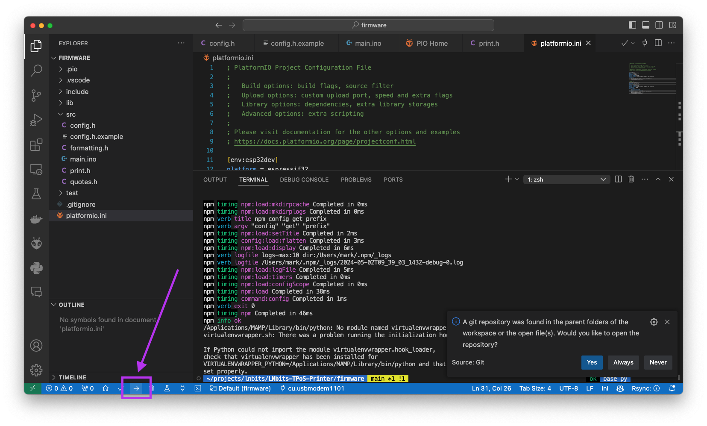

# LNbits TpoS Printer

This project features an ESP32 controlled thermal printer solution to print payment receipts as payments are made to the LNbits TPoS extension.

Buy a complete kit on the LNbits shop: https://shop.lnbits.com/product/lnbits-tpos-thermal-receipt-printer

The project is fully inspired by the [Coinos printer](https://github.com/coinos/coinos-printer) project.

## Parts

1. An ESP32. This project used an ESP32-C3 SuperMini but any ESP32 will do as long as you can smush it into an enclosure
1. A 58mm Embedded Thermal Printer with TTL interface

## Flash firmware to the ESP32-C3

You will need:

+ Visual Studio Code with the platformio extension installed
+ Your ESP32-C3 board
+ A USB-C cable.

1. Open VS Code and open the `firmware` directory that is in this repo. Platformio will initialise the project and load all required dependencies.
1. Copy the file config.h.example to config.h and edit the variables in the file to your own values:
1. Connect your ESP32 board to your computer using the USB-C cable
1. Click the Upload button (the right facing arrow in the footer of the VS code IDE)

1. After flashing, your printer will connect to WiFi and print a short status message.

## Setup

Connect the printer to the ESP32 as follows.

You will probably need a seperate power supply for the printer as it needs ~ 1amp which an ESP32 struggles to provide.

1. Printer GND to ESP32 GND and power supply GND
1. Printer VCC to power supply 5v - 9v
1. Printer RX to ESP32 GPIO 21
1. Printer TX to ESP32 GPIO 2

You *may* be able to use the ESP32 5v pin to power the printer and I have had some success with this. However print quality is slightly degraded and speed is low. If you are going to do this, use a 5V power supply with at least 2 amps available. Wiring as follows:

1. Printer GND to ESP32 GND
1. Printer VCC to ESP32 5v
1. Printer RX to ESP32 GPIO 21
1. Printer TX to ESP32 GPIO 2

## Firmware

1. Copy config.h.example to config.h
1. Edit config.h to match your setup
1. Compile and upload to ESP32
1. Power on